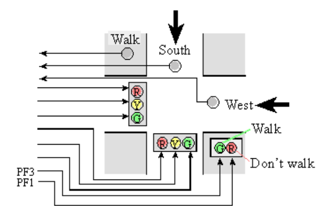
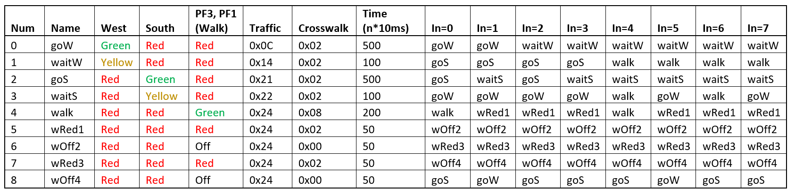

# Traffic_Light_Simulation
An embedded project simulating a two-way traffic light with a pedestrian crosswalk using switches and LEDs. The project uses an index implementation of a Moore state FSM design, requiring fixed time delays using the SysTick timer as well as initializing and wiring of the I/O ports. The project was written to an ARM Cortex-M TM4C123G Launchpad using C. Debugging required a virtual logic analyzer and oscilloscope.

## Visualization of the Crosswalk

## State Transition Table:

## Video of the program running: 

